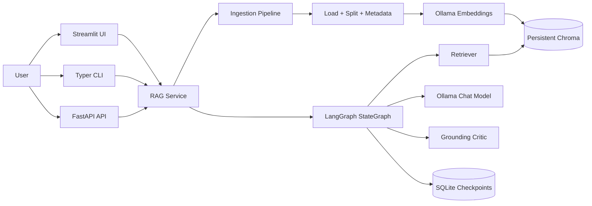
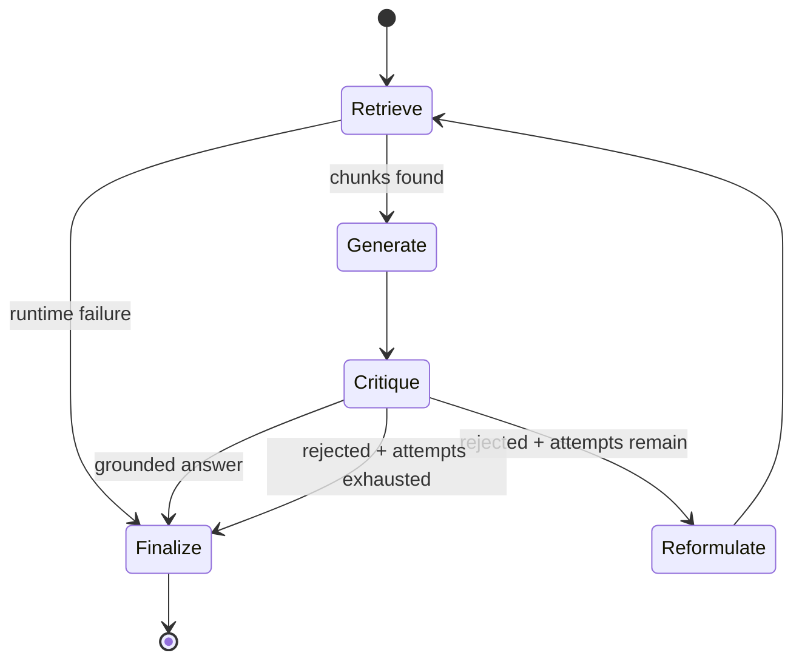
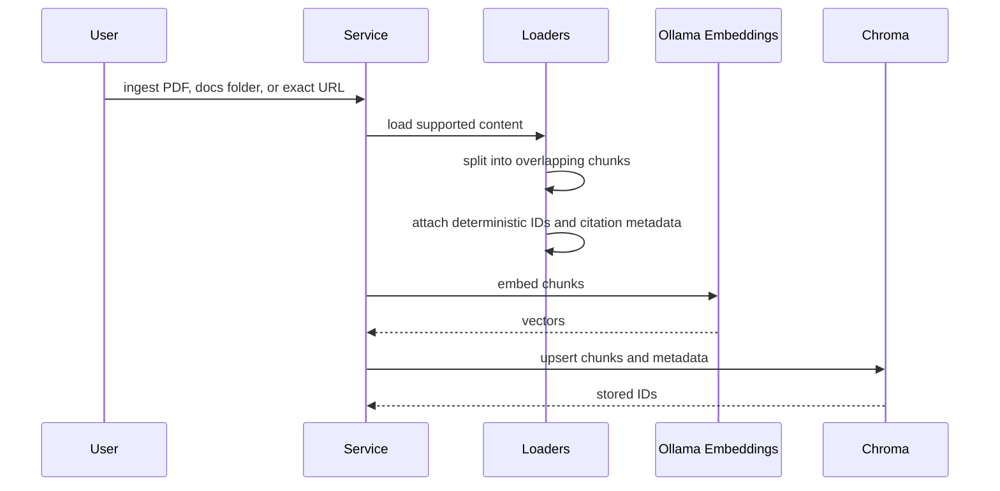
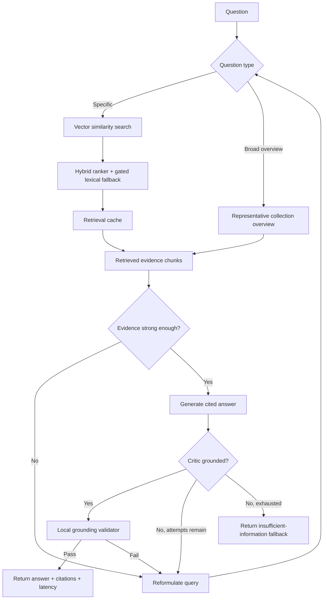

# Self-Healing RAG

A local Retrieval-Augmented Generation pipeline that retrieves evidence, generates an answer, critiques whether the answer is grounded in the retrieved chunks, and retries with a reformulated query before returning a safe fallback.

The graph is modeled with LangGraph as a cyclical workflow. It is designed for local development with Ollama, Chroma, FastAPI, Typer, and Streamlit.

## Architecture



## Self-Healing Workflow



## Ingestion Flow



## Ask Flow



The overview retrieval path is what makes questions like `What is this document about?` work reliably. It retrieves representative chunks from the indexed collection instead of asking the vector store to infer intent from a vague query.

## Setup

```bash
python3 -m venv .venv
source .venv/bin/activate
pip install -e ".[dev]"
```

Start Ollama and pull the default models:

```bash
ollama serve
ollama pull llama3:latest
ollama pull nomic-embed-text
```

In another terminal:

```bash
rag doctor
```

Expected healthy output:

```text
ok   python: 3.13.7
ok   chroma_path: data/chroma
ok   checkpoint_db: data/checkpoints.sqlite
ok   ollama_server: 200 OK
ok   chat_model: llama3:latest
ok   embedding_model: nomic-embed-text
```

## CLI

Put documents in `data/docs` first, or upload documents in the Streamlit UI:

```bash
rag ingest ./data/docs --collection default
rag ask "What is this document about?" --collection default
rag ask "What does the document say about retries?" --collection default
rag reset --collection default
```

For precise document-focused questions, pass the exact source shown in the UI source picker or the collection stats API:

```bash
rag ask "What is this document about?" --source "upload:paper.pdf" --collection default
```

You can also ingest one exact URL:

```bash
rag ingest https://example.com/single-page --collection default
```

Run the API or UI:

```bash
rag serve --host 127.0.0.1 --port 8000
rag ui --host 127.0.0.1 --port 8501
```

## Streamlit UI

Run the local frontend:

```bash
rag ui
```

Then open `http://127.0.0.1:8501`.

The UI is chat-first. The sidebar handles PDF/TXT/Markdown/HTML upload ingestion, server-local path ingestion, exact single-page URL ingestion, source selection, collection reset, and runtime checks.

Each new UI chat starts with its own isolated Chroma collection. That means restarting the UI or pressing `New chat` will not automatically reuse documents from an older chat. Older chat workspaces remain available from `Chat logs`, and selecting a log restores that chat's messages and document workspace.

`Sources to search` is the retrieval scope. Use one selected source when you ask vague questions like `What is this document about?`; keep several selected when you want the answer synthesized across multiple indexed documents.

## API

```bash
curl http://127.0.0.1:8000/health

curl -X POST http://127.0.0.1:8000/ingest \
  -H "content-type: application/json" \
  -d '{"sources":["./data/docs"],"collection":"default"}'

curl -X POST http://127.0.0.1:8000/ask \
  -H "content-type: application/json" \
  -d '{"question":"What does the document say about retries?","collection":"default","max_attempts":3}'

curl http://127.0.0.1:8000/collections/default/stats
```

Upload ingestion supports PDF, TXT, Markdown, and HTML:

```bash
curl -X POST http://127.0.0.1:8000/ingest/upload \
  -F "collection=default" \
  -F "file=@paper.pdf"
```

## Configuration

Settings are read from environment variables prefixed with `RAG_`. See `.env.example`.

Defaults:

- Chroma path: `data/chroma`
- LangGraph checkpoint DB: `data/checkpoints.sqlite`
- Chat model: `llama3:latest`
- Embedding model: `nomic-embed-text`
- Retrieval: `top_k=6`, `fetch_k=20`
- Retrieval quality: vector search plus lexical fallback, source diversification, MMR-style reranking, and `min_retrieval_confidence=0.08`
- Response time: in-memory retrieval cache size `128`, stats cache size `32`, same-thread answer cache size `64`, Ollama keep-alive `10m`, answer token cap `512`, local critic mode by default, deterministic query rewrite by default, and lexical fallback only when vector evidence does not already cover the query
- Chunking: `chunk_size=1000`, `chunk_overlap=150`
- Retry limit: `max_attempts=3`

Every `/ask` response includes per-attempt timings (`retrieval_ms`, `generation_ms`, `critique_ms`, `total_ms`) plus full request `total_ms`.

URL ingestion fetches only the exact URLs supplied. It blocks `file://`, localhost, and private-network targets unless `RAG_ALLOW_PRIVATE_URLS=true`.

## Tests

```bash
pytest
```

Optional local Ollama checks can be added behind `RUN_OLLAMA_TESTS=1`; the default test suite uses fakes and does not require Ollama to be running.
